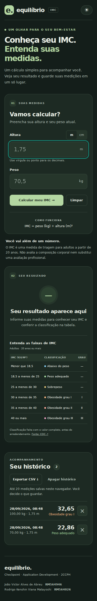

# Equilíbrio — Calculadora de IMC

Projeto do **Checkpoint 02 de Application Development**, turma **2CCPH — FIAP**.

Aplicação desenvolvida em React para calcular o Índice de Massa Corporal (IMC), consultar a classificação do resultado e acompanhar medições salvas no navegador. Interface responsiva, com temas claro e escuro.

[Ver demonstração](#demonstração) · [Executar o projeto](#como-executar) · [Documentação](#documentação) · [Integrantes](#integrantes)

## Demonstração

**Clique na imagem para abrir o vídeo do projeto em funcionamento:**

[](docs/demo/Projeto-rodando.mp4)

🎬 **[Assistir ao vídeo — Projeto rodando](docs/demo/Projeto-rodando.mp4)** · [Abrir ou baixar o MP4 original](https://raw.githubusercontent.com/JoaoVictorAAbreu-Dev/Fiap-cp02-appication-development/main/docs/demo/Projeto-rodando.mp4)

## Funcionalidades

- **Cálculo de IMC:** peso em quilogramas e altura em metros ou centímetros, com entrada decimal por vírgula ou ponto.
- **Validação dos campos:** mensagens para entradas vazias, inválidas ou fora dos limites aceitos.
- **Resultado e classificação:** exibição do IMC e destaque da faixa correspondente na tabela.
- **Histórico de medições:** salvamento manual de até 20 registros no navegador, com exclusão individual ou total.
- **Exportação CSV:** download do histórico para consulta em planilhas.
- **Temas claro e escuro:** preferência mantida entre acessos.
- **Layout responsivo:** adaptação para desktop e celular.

Os dados são armazenados em `localStorage`. O projeto funciona no navegador, sem backend ou sincronização entre dispositivos.

## Tecnologias

| Tecnologia | Uso |
| --- | --- |
| React 19 | Interface, componentes e gerenciamento de estado |
| Vite 8 | Servidor de desenvolvimento e build de produção |
| JavaScript e CSS | Lógica da aplicação e estilos |
| ESLint | Verificação estática do código |
| Node.js Test Runner | Testes automatizados da lógica de IMC e do histórico |

## Como executar

### Pré-requisitos

- **Node.js 22.12 ou superior**, conforme `package.json`.
- **npm** e **Git** disponíveis no terminal.

### Instalação e desenvolvimento

```bash
git clone https://github.com/JoaoVictorAAbreu-Dev/Fiap-cp02-appication-development.git
cd Fiap-cp02-appication-development
npm ci
npm run dev
```

Abra no navegador o endereço exibido pelo Vite no terminal.

### Comandos disponíveis

| Comando | Descrição |
| --- | --- |
| `npm run dev` | Inicia o servidor de desenvolvimento |
| `npm test` | Executa os testes automatizados |
| `npm run lint` | Verifica o código com ESLint |
| `npm run build` | Gera a versão de produção em `dist/` |
| `npm run preview` | Permite conferir localmente a build gerada |

Para conferir a versão de produção:

```bash
npm run build
npm run preview
```

## Como usar

1. Informe a altura e selecione a unidade: metros ou centímetros.
2. Informe o peso em quilogramas e clique em **Calcular IMC**.
3. Consulte o resultado e a faixa destacada na tabela.
4. Salve a medição para adicioná-la ao histórico.
5. Consulte os registros, exclua medições ou exporte o histórico em CSV.

## Capturas de tela

| Resultado do cálculo | Histórico de medições |
| --- | --- |
|  |  |

<details>
<summary>Visual no celular com tema escuro</summary>



</details>

## Estrutura do projeto

```text
.
├── docs/
│   ├── demo/Projeto-rodando.mp4  # Vídeo de demonstração
│   ├── CRITERIOS.md             # Correspondência com o checkpoint
│   ├── DEMONSTRACAO.md          # Roteiro de apresentação
│   ├── VALIDACAO.md             # Registro de validação da entrega
│   └── tela-*.png               # Capturas da interface
├── src/
│   ├── components/             # Formulário, resultado, histórico e botão
│   ├── data/data.js             # Faixas de classificação do IMC
│   ├── utils/imc.js             # Cálculo, validação, histórico e CSV
│   ├── App.jsx                 # Integração dos componentes e estado
│   ├── App.css                 # Estilos da aplicação
│   ├── index.css               # Estilos globais
│   └── main.jsx                # Entrada da aplicação React
├── tests/imc.test.js            # Testes da lógica da aplicação
├── index.html
├── eslint.config.js
├── vite.config.js
├── package.json
└── package-lock.json
```

## Documentação

- [Critérios do checkpoint](docs/CRITERIOS.md): relação entre os requisitos e a implementação.
- [Roteiro de demonstração](docs/DEMONSTRACAO.md): sequência para apresentar as funcionalidades.
- [Registro de validação](docs/VALIDACAO.md): verificações documentadas na entrega original, com seus limites.

## Integrantes

| Nome | RM |
| --- | --- |
| João Victor Alves de Abreu | 564946 |
| Rodrigo Kenshin Viana Matayoshi | 564026 |

**FIAP · Application Development · 2CCPH**
